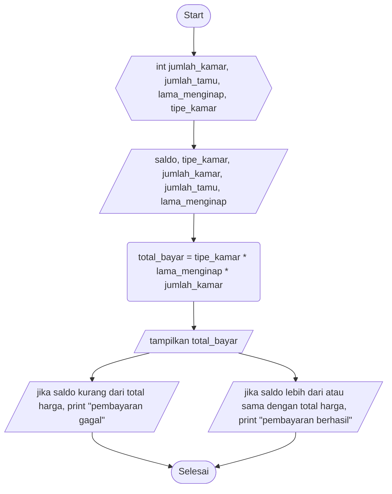

```mermaid
flowchart TD;
    A([Start])-->B{{
        int jumlah_kamar;
        int jumlah_tamu;
        int lama_menginap;
        int tipe_kamar;
    }};
    B{{int jumlah_kamar, jumlah_tamu, lama_menginap, tipe_kamar}}-->C[/saldo, tipe_kamar, jumlah_kamar, jumlah_tamu, lama_menginap/];
    C[/saldo, tipe_kamar, jumlah_kamar, jumlah_tamu, lama_menginap/]-->D(total_bayar = tipe_kamar * lama_menginap * jumlah_kamar);
    D(total_bayar = tipe_kamar * lama_menginap * jumlah_kamar)-->E[/tampilkan total_bayar/];
    E[/tampilkan total_bayar/]-->F[/jika saldo kurang dari total harga, print "pembayaran gagal"/];
    E[/tampilkan total_bayar/]-->G[/jika saldo lebih dari atau sama dengan total harga, print "pembayaran berhasil"/];
    F[/jika saldo kurang dari total harga, print "pembayaran gagal"/]-->H([Selesai]);
    G[/jika saldo lebih dari atau sama dengan total harga, print "pembayaran berhasil"/]-->H([Selesai]);
```
