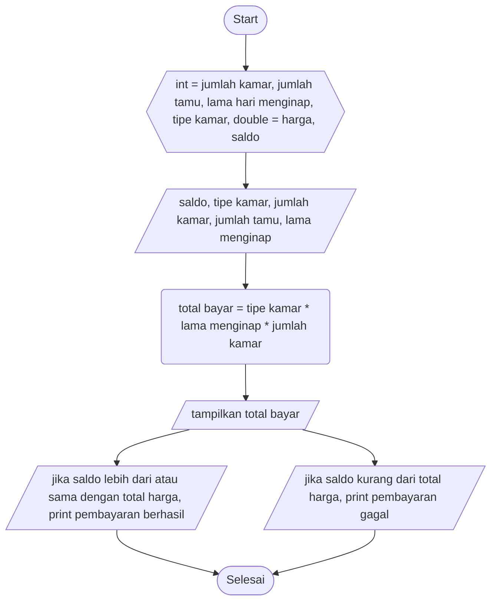

```mermaid
flowchart TD;
    A([Start])-->B{{int = jumlah kamar, jumlah tamu, lama hari menginap, tipe kamar, double = harga, saldo}};
    B{{int = jumlah kamar, jumlah tamu, lama hari menginap, tipe kamar, double = harga, saldo}}-->C[/saldo, tipe kamar, jumlah kamar, jumlah tamu, lama menginap/];
    C[/saldo, tipe kamar, jumlah kamar, jumlah tamu, lama menginap/]-->D(total bayar = tipe kamar * lama menginap * jumlah kamar);
    D(total bayar = tipe kamar * lama menginap * jumlah kamar)-->E[/tampilkan total bayar/];
    E[/tampilkan total bayar/]-->F[/jika saldo kurang dari total harga, print pembayaran gagal/];
    E[/tampilkan total bayar/]-->G[/jika saldo lebih dari atau sama dengan total harga, print pembayaran berhasil/];
    G[/jika saldo lebih dari atau sama dengan total harga, print pembayaran berhasil/]-->H([Selesai]);
    F[/jika saldo kurang dari total harga, print pembayaran gagal/]-->H([Selesai]);
```
