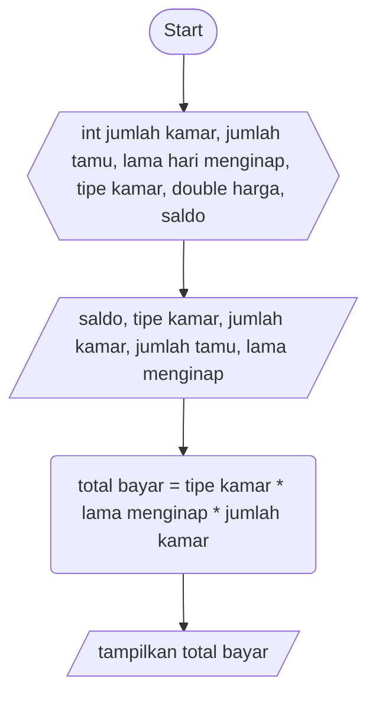

```mermaid
flowchart TD;
    A([Start])-->B{{int jumlah kamar, jumlah tamu, lama hari menginap, tipe kamar, double harga, saldo}};
    B{{int jumlah kamar, jumlah tamu, lama hari menginap, tipe kamar, double harga, saldo}}-->C[/saldo, tipe kamar, jumlah kamar, jumlah tamu, lama menginap/];
    C[/saldo, tipe kamar, jumlah kamar, jumlah tamu, lama menginap/]-->D(total bayar = tipe kamar * lama menginap * jumlah kamar);
    D(total bayar = tipe kamar * lama menginap * jumlah kamar)-->E[/tampilkan total bayar/];

```
