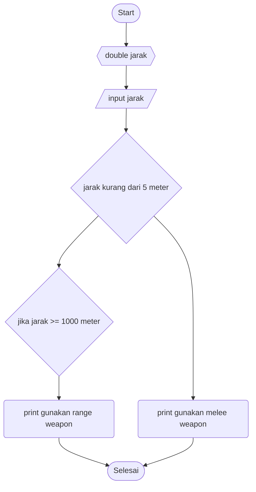

# Latihan Individu 1 #

```mermaid
graph TD;
    A([Start])-->B{{double jarak}};
    B{{double jarak}}-->C[/input jarak/];
    C[/input jarak/]-->D{jarak kurang dari 5 meter};
    D{jarak kurang dari 5 meter}-->E(print gunakan melee weapon);
    D{jarak kurang dari 5 meter}-->F{jika jarak >= 1000 meter};
    F{jika jarak >= 1000 meter}-->G(print gunakan range weapon);
    G(print gunakan range weapon)-->H([Selesai]);
    E(print gunakan melee weapon)-->H([Selesai]);
```
