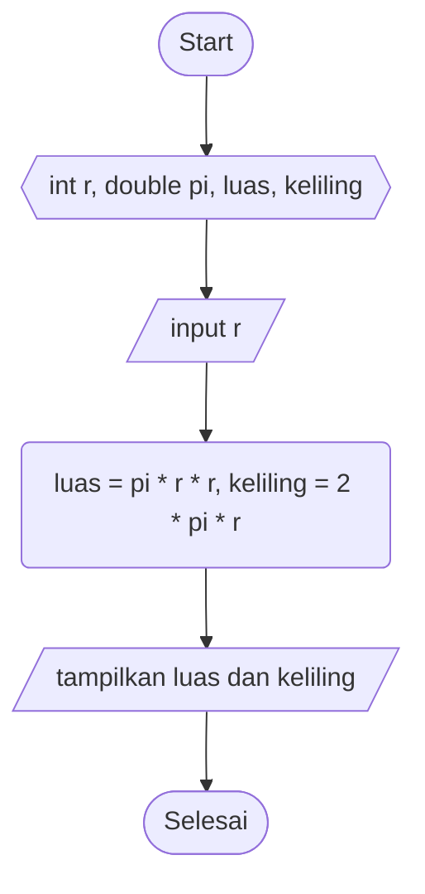

# Latihan Individu 1 #

```mermaid
graph TD;
    A([Start])-->B{{int r, double pi, luas, keliling}};
    B{{int r, double pi, luas, keliling}}-->C[/input r/];
    C[/input r/]-->D(luas = pi * r * r, keliling = 2 * pi * r);
    D(luas = pi * r * r, keliling = 2 * pi * r)-->E[/tampilkan luas dan keliling/];
    E[/tampilkan luas dan keliling/]-->F([Selesai]);
```
