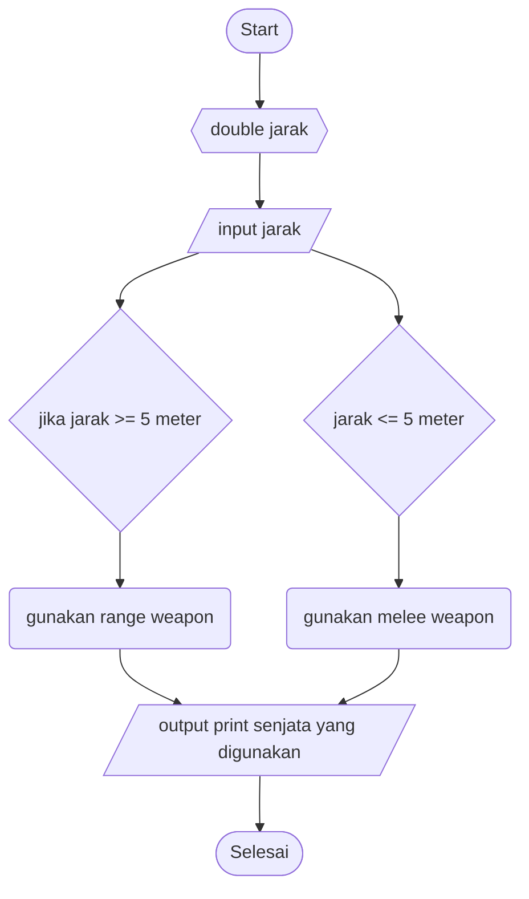

# Latihan Individu 1 #

```mermaid
graph TD;
    1([Start])-->2{{double jarak}};
    2{{double jarak}}-->3[/input jarak/];
    3[/input jarak/]-->4{jika jarak >= 5 meter};
    3[/input jarak/]-->6{jarak <= 5 meter};
    4{jika jarak >= 5 meter}-->7(gunakan range weapon);
    6{jarak <= 5 meter}-->8(gunakan melee weapon);
    7(gunakan range weapon)-->9[/output print senjata yang digunakan/];
    8(gunakan melee weapon)-->9[/output print senjata yang digunakan/];
    9[/output print senjata yang digunakan/]-->10([Selesai]);

```
