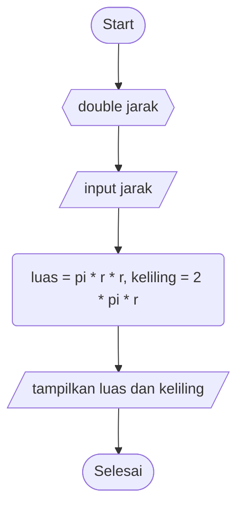

# Latihan Individu 1 #

```mermaid
graph TD;
    A([Start])-->B{{double jarak}};
    B{{double jarak}}-->C[/input jarak/];
    C[/input jarak/]-->D{luas = pi * r * r, keliling = 2 * pi * r};
    D(luas = pi * r * r, keliling = 2 * pi * r)-->E[/tampilkan luas dan keliling/];
    E[/tampilkan luas dan keliling/]-->F([Selesai]);
```
