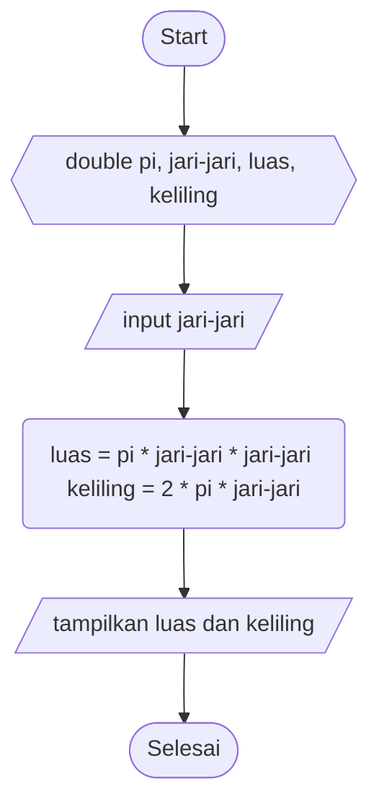

```mermaid
graph TD;
    A([Start])-->B{{double pi, jari-jari, luas, keliling}};
    B{{double pi, jari-jari, luas, keliling}}-->C[/input jari-jari/];
    C[/input jari-jari/]-->D(luas = pi * jari-jari * jari-jari keliling = 2 * pi * jari-jari);
    D(luas = pi * jari-jari * jari-jari keliling = 2 * pi * jari-jari)-->E[/tampilkan luas dan keliling/];
    E[/tampilkan luas dan keliling/]-->F([Selesai]);
```
