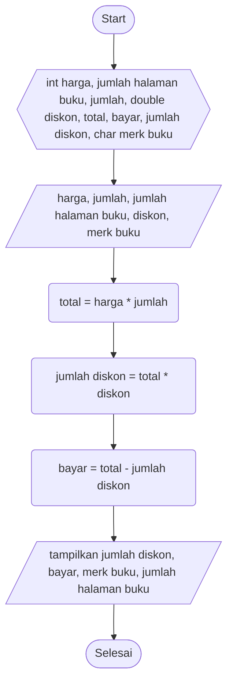

# Flowchart #

```mermaid
graph TD;
    A([Start])-->B{{int harga, jumlah halaman buku, jumlah, double diskon, total, bayar, jumlah diskon, char merk buku}};
    B{{int harga, jumlah halaman buku, jumlah, double diskon, total, bayar, jumlah diskon, char merk buku}}-->C[/harga, jumlah, jumlah halaman buku, diskon, merk buku/];
    C[/harga, jumlah, jumlah halaman buku, diskon, merk buku/]-->D(total = harga * jumlah);
    D(total = harga * jumlah)-->E(jumlah diskon = total * diskon);
    E(jumlah diskon = total * diskon)-->F(bayar = total - jumlah diskon);
    F(bayar = total - jumlah diskon)-->G[/tampilkan jumlah diskon, bayar, merk buku, jumlah halaman buku/];
    G[/tampilkan jumlah diskon, bayar, merk buku, jumlah halaman buku/]-->H([Selesai]);
```
