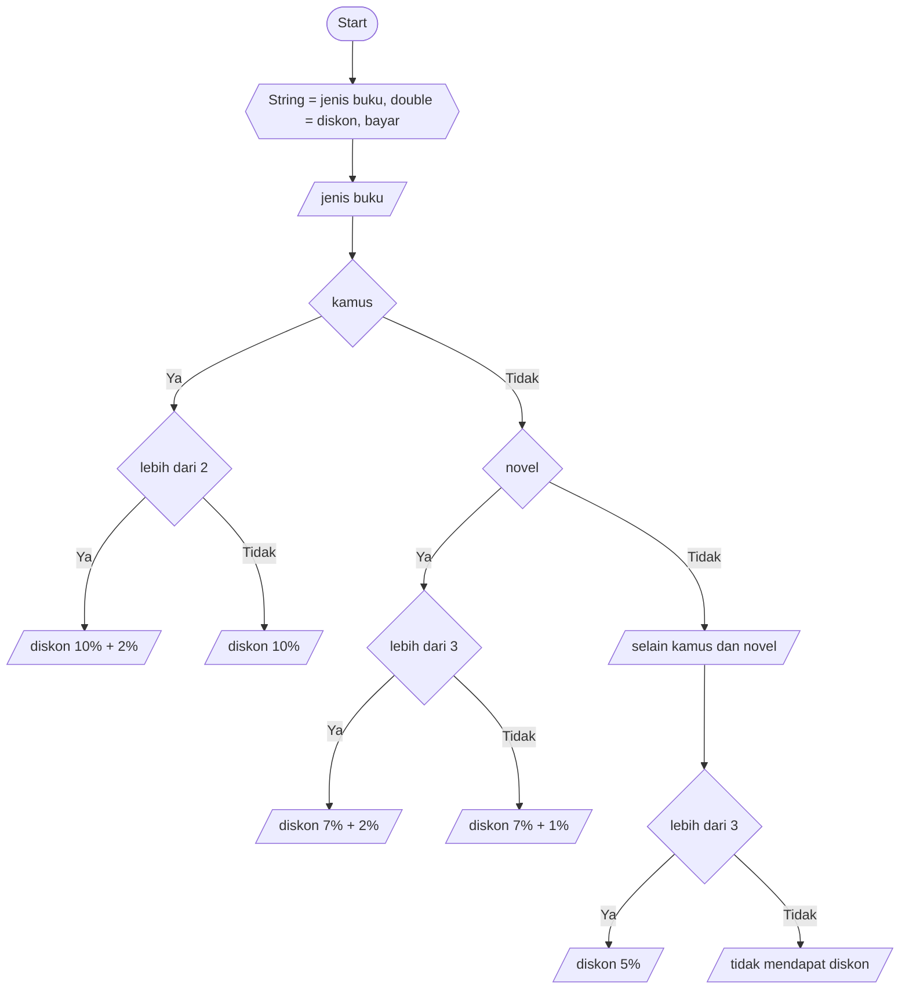

# Flowchart #

```mermaid
flowchart TD;
1([Start])-->2{{String = jenis buku, double = diskon, bayar}};
2{{String = jenis buku, double = diskon, bayar}}-->3[/jenis buku/];
3[/jenis buku/]-->4{kamus};
4{kamus}-->|Ya|5{lebih dari 2};
5{lebih dari 2}-->|Ya|6[/diskon 10% + 2%/];
5{lebih dari 2}-->|Tidak|7[/diskon 10%/];
4{kamus}-->|Tidak|8{novel};
8{novel}-->|Ya|9{lebih dari 3};
9{lebih dari 3}-->|Ya|10[/diskon 7% + 2%/];
9{lebih dari 3}-->|Tidak|11[/diskon 7% + 1%/];
8{novel}-->|Tidak|12[/selain kamus dan novel/];
12[/selain kamus dan novel/]-->13{lebih dari 3};
13{lebih dari 3}-->|Ya|14[/diskon 5%/];
13{lebih dari 3}-->|Tidak|15[/tidak mendapat diskon/];
```
