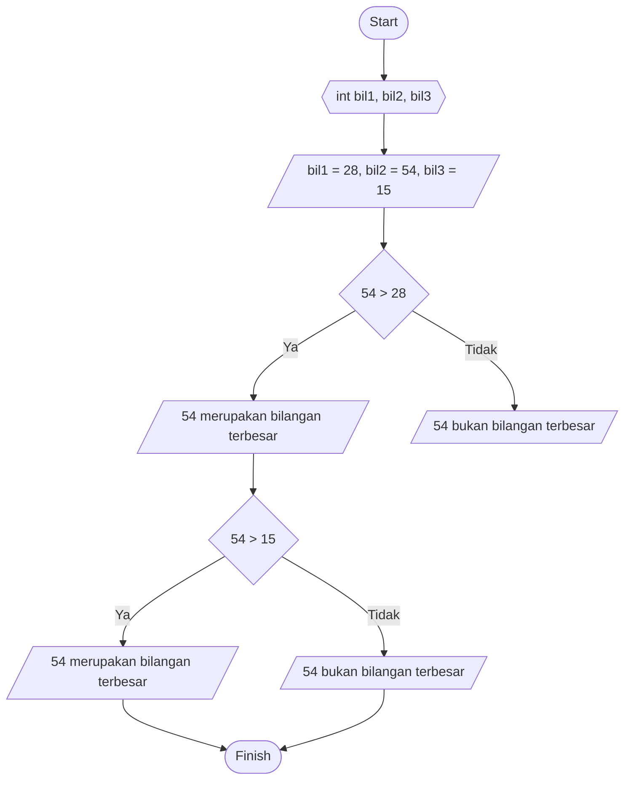

# Flowchart #

```mermaid
flowchart TD;
1([Start])-->2{{int bil1, bil2, bil3}};
2{{int bil1, bil2, bil3}}-->3[/bil1 = 28, bil2 = 54, bil3 = 15/];
3[/bil1 = 28, bil2 = 54, bil3 = 15/]-->4{54 > 28};
4{54 > 28}-->|Ya|5[/54 merupakan bilangan terbesar/];
4{54 > 28}-->|Tidak|6[/54 bukan bilangan terbesar/];
5[/54 merupakan bilangan terbesar/]-->7{54 > 15};
7{54 > 15}-->|Ya|8[/54 merupakan bilangan terbesar/];
7{54 > 15}-->|Tidak|9[/54 bukan bilangan terbesar/];
8[/54 merupakan bilangan terbesar/]-->10([Finish]);
9[/54 bukan bilangan terbesar/]-->10([Finish]);
```
